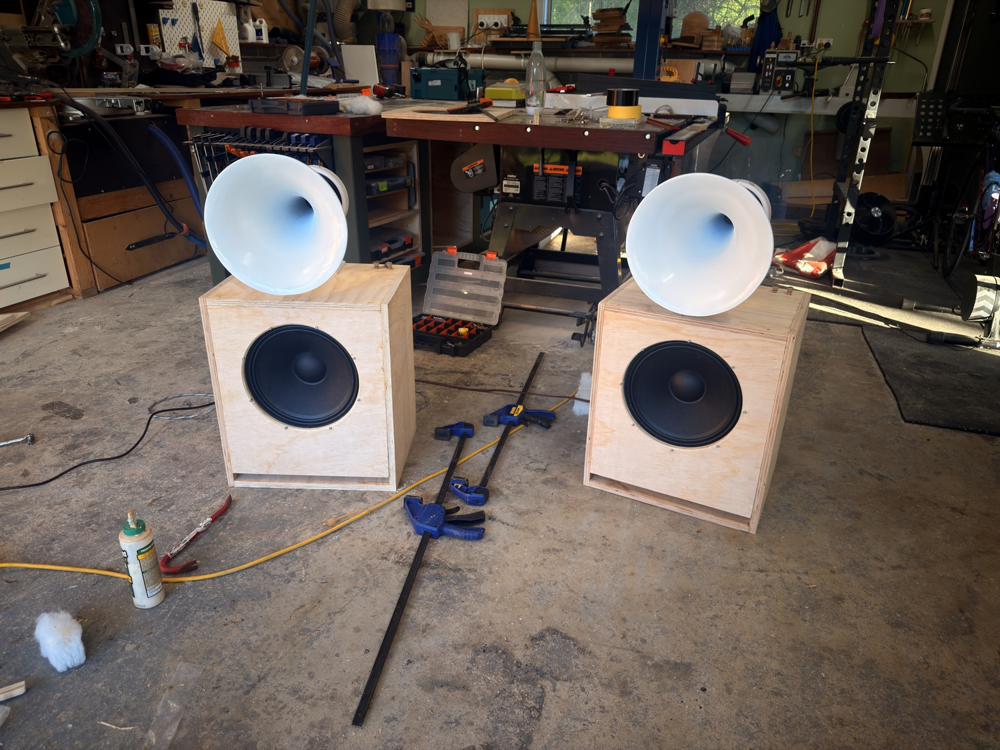

# MP-H1 — a high-sensitivity 2-way with a 3D-printed tractrix horn



An OJAS / Devon Turnbull–inspired two-way: a 12″ pro woofer in a modest reflex
box, and a 1.4″ compression driver on a **3D-printed round tractrix horn** that
sits on top of the cabinet. Both drivers run from a **single amplifier channel**;
the passive crossover is four parts (on the compression driver only) and all the
voicing is done in DSP.

The point of this repo is that it's **designed from the Thiele/Small parameters
up** — the horn profile, the box alignment, and the drawings are all *generated*
by the scripts here. Change the driver, the box volume, or the flare cutoff, and
you can regenerate the whole design.

📄 **Start with the [full build & design paper (PDF)](speaker_docs/MP-H1-Build-and-Design.pdf)** — the maths, the crossover, the tuning method, and the story, in one place.

---

## Specs (as built)

| | |
|---|---|
| **Format** | Two-way, high-efficiency · passive XO (CD only) + DSP voicing · single amp channel |
| **Woofer** | 12″ Peerless by Tymphany **FSL-1225R02-08** — 96.2 dB, reflex |
| **Compression driver** | 1.4″ SB Audience **ROSSO-65CD-T** — 108 dB, titanium |
| **Enclosure** | 62 L net reflex, **f_b ≈ 47 Hz** · 456 × 536 × 366 mm · 18 mm Baltic birch · front slot port |
| **Horn** | Round tractrix, **f_c = 340 Hz** · Ø321 mm mouth · 303 mm long · printed in sections |
| **Crossover** | ≈ 1.2 kHz 2nd-order Butterworth (12 µF + 1.5 mH) · L-pad 6.8 Ω / 2.7 Ω |
| **Extension** | F3 = 67 Hz · F6 = 47 Hz · F10 = 38 Hz — flat into the mid-40s in-room with DSP |
| **Amplification** | Single channel — NAD C 700 + Dirac Live |
| **Cost** | ≈ AU$1,650–1,850 / pair |

## The design, in three ideas

- **Minimal passive parts.** The woofer runs *direct* — no series inductor. Only the compression driver carries a network (a 2nd-order high-pass + a level-matching L-pad).
- **Efficiency first.** 96 dB woofer, 108 dB horn — happy on a handful of watts, so amp quality matters more than power.
- **DSP does the voicing.** Baffle-step, the low-shelf lift, the 40 Hz excursion high-pass and room correction all live in DSP, not the crossover.

## What's in here

```
scripts/        The generators — the reproducible heart of the design
  tractrix.py     horn profile from a flare cutoff frequency
  horn_cad.py     builds the printable horn (neck + bell quadrants), headless build123d
  box_model.py    vented-box (Small) alignment + port model, per driver
  drawings.py     dimensioned cutting drawings (matplotlib → PDF)
cad/            STL (print), STEP (universal CAD), F3D (Fusion), 3MF, drawings.pdf, profile CSVs
speaker_docs/   design-notes.md · BOM.md · build-guide.md · dsp-tuning-guide.md · the build paper (PDF)
website/        the crossover schematic + board-layout page (open index.html)
images/         build photos
```

## Regenerate the design

```bash
python3 -m venv .venv
.venv/bin/pip install build123d numpy scipy matplotlib

.venv/bin/python scripts/box_model.py                     # box alignment + port, prints the response
.venv/bin/python scripts/tractrix.py 340 cad/horn_profile_340.csv   # horn profile CSV
.venv/bin/python scripts/horn_cad.py                      # → cad/horn_neck.stl + horn_bell_quadrant.stl (+ .step)
.venv/bin/python scripts/drawings.py                      # → cad/drawings.pdf
```

Want a different horn? Change the flare cutoff (`tractrix.py <fc>`); a different
woofer or box? Edit the T/S set / volume in `box_model.py` and re-check the
alignment before you cut anything.

## Print the horn

Per speaker: **1 × `horn_neck.stl` + 4 × `horn_bell_quadrant.stl` + 1 × `driver_stand.stl`**.

- **PETG**, 0.2 mm layers, **6 mm walls** (≈ 8 perimeters or 30 %+ gyroid). The horn must be *dead* — a knuckle-rap should give a dull thock, not a ring.
- The bell quadrants are one identical part rotated 90° four times, with **integral tongue-and-groove** on every seam — dry-fit, epoxy in the grooves, tape, cure. No hardware.
- The **driver stand is structural** (it carries the 3.76 kg driver) — 50 %+ infill, 6 perimeters.

Full sequence, finishing, and the wiring in **[speaker_docs/build-guide.md](speaker_docs/build-guide.md)**.

## Build & tune

1. Order parts — **[speaker_docs/BOM.md](speaker_docs/BOM.md)**
2. Start the horn prints (longest lead time)
3. Build the cabinets — **[speaker_docs/build-guide.md](speaker_docs/build-guide.md)** + the drawings in `cad/`
4. Wire the crossover (**[website/index.html](website/index.html)** has the schematic + board layout), assemble, then measure and voice — **[speaker_docs/dsp-tuning-guide.md](speaker_docs/dsp-tuning-guide.md)**

> **One hard-won tip:** before you second-guess the acoustics on first power-up, **battery-test your woofer polarity**. A single reversed woofer makes a stereo pair sound thin and lifeless — the two cancel in the room. Ask me how I know.

## Licence

- **Hardware, CAD, and docs** → [CC BY-SA 4.0](LICENSE) (share & adapt, keep derivatives open, credit the source)
- **Scripts** (`scripts/`) → [MIT](LICENSE-CODE)

Build it, remix it, improve it — please do. If you make a better horn, open a PR.

---

*Designed and built by Tom Andrews on the Mornington Peninsula, Australia.
Round tractrix, single-amp, high-sensitivity two-way. Next revision: **MP-H2**,
an elliptical R-OSSE waveguide swap-in.*
